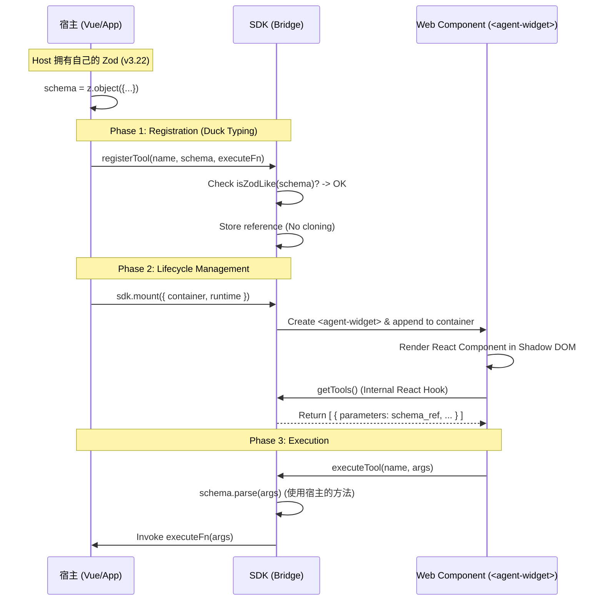

# 技术架构设计文档：SDK "Universal Bridge" 模式

**Version:** 2.0.0 (Compatibility Focused)
**Status:** **Implemented**
**Architect:** Senior CPTO

## 1. 核心目标 (Objective)

构建一个**零依赖入侵、高兼容性**的 SDK，连接宿主环境（Host）与 UI 组件（Web Component）。
实现**“依赖解耦”**：SDK 不绑定特定的 Zod 版本，允许宿主自由选择依赖版本，同时确保跨环境的运行时安全。

## 2. 核心策略 (Core Strategy)

| 策略维度     | 旧方案 (Strict)    | **新方案 (Universal) - 最终选型**                                     | 优势 (ROI)                                          |
| ------------ | ------------------ | --------------------------------------------------------------------- | --------------------------------------------------- |
| **依赖管理** | SDK 强行导出 `zod` | **Peer Dependencies**: SDK 声明“我需要 Zod”，但不包含它。             | 避免包体积膨胀，支持宿主任意 Zod 版本 (v3.x)。      |
| **类型校验** | `instanceof` 检查  | **Duck Typing**: 检查对象是否具有 `.parse()` 和 `_def` 特征。         | 彻底解决跨 Bundle、跨版本的 `instanceof` 失败问题。 |
| **数据流转** | 严格类型绑定       | **Reference Passing**: 宿主创建 Schema 对象，SDK 和 UI 仅作引用传递。 | 内存零开销，UI 库直接消费原始 Schema 对象。         |
| **UI 渲染**  | Host 负责挂载      | **SDK Managed**: SDK 提供 `mount/unmount` 方法，控制 Web Component。  | 宿主无需关心 React 渲染细节，只需调用 SDK 方法。    |
| **样式隔离** | 全局污染风险       | **Shadow DOM + Tailwind**: Web Component 内部封装 Tailwind 样式。     | 样式完全隔离，宿主样式不影响组件，组件样式不泄露。  |

---

## 3. 架构设计 (Architecture Design)

### 3.1 数据流向 (Data Flow)



---

## 4. 详细实现规范 (Implementation Specs)

### 4.1 SDK 层 (The Universal Bridge)

**职责：** 极其轻量，负责存储、“鸭子类型”校验以及 Web Component 的生命周期管理。

```typescript
// sdk/index.ts
export class BridgeSDK {
  // ... (Registration logic same as before)

  /**
   * Mounts the Agent Widget to the DOM.
   * Assumes the <agent-widget> custom element is registered.
   */
  public mount(options: MountOptions = {}) {
    if (this.widgetElement) {
      console.warn('[SDK] Widget is already mounted.');
      return;
    }

    const tagName = 'agent-widget';
    // Ensure custom element is defined (side-effect import in host recommended)
    this.widgetElement = document.createElement(tagName);

    if (options.runtime) {
      (this.widgetElement as any).runtime = options.runtime;
    }

    const container = options.container || document.body;
    container.appendChild(this.widgetElement);
  }

  public unmount() {
    if (this.widgetElement && this.widgetElement.parentNode) {
      this.widgetElement.parentNode.removeChild(this.widgetElement);
    }
    this.widgetElement = null;
  }
}
```

### 4.2 Web Component 层 (React UI)

**职责：**
1. 封装 React 组件为 Custom Element (`<agent-widget>`)。
2. 使用 Shadow DOM 隔离样式。
3. 集成 `@assistant-ui/react` 和 `@assistant-ui/react-ui`。
4. 注入 Tailwind CSS 样式到 Shadow Root。

```tsx
// wc/element.tsx
import styles from './styles.css?inline'; // Injected by Vite

export class AgentWidgetElement extends HTMLElement {
  connectedCallback() {
    if (!this.root) {
      this.attachShadow({ mode: 'open' });

      // Inject Tailwind Styles
      const styleTag = document.createElement('style');
      styleTag.textContent = styles;
      this.shadowRoot!.appendChild(styleTag);

      // ... Render React Root
    }
  }
}
```

### 4.3 宿主层 (Host Implementation)

**职责：** 注册工具，并调用 SDK 挂载 UI。

```typescript
// host/app.ts
import { BridgeSDK } from 'my-agent-sdk';
import 'agent-widget'; // Register Custom Element

const sdk = BridgeSDK.getInstance();

sdk.registerTool({ ... });

// 挂载 UI
sdk.mount({
  container: document.getElementById('chat-container'),
  runtime: myRuntime // Optional mock runtime
});
```

---

## 5. 工程化配置 (Build Configuration)

### 5.1 SDK `package.json`

```json
{
  "name": "my-agent-sdk",
  "peerDependencies": {
    "zod": "^3.0.0" 
  }
}
```

### 5.2 Web Component `package.json`

使用 Tailwind CSS 进行样式构建。

```json
{
  "name": "agent-widget",
  "dependencies": {
    "@assistant-ui/react": "^0.0.0",
    "@assistant-ui/react-ui": "^0.0.0",
    "my-agent-sdk": "workspace:*"
  },
  "devDependencies": {
    "tailwindcss": "^3.4.17",
    "postcss": "^8.4.35",
    "autoprefixer": "^10.4.17"
  }
}
```

### 5.3 Playground

`apps/playground/react-playground` 用于验证完整流程：
1. `useLocalRuntime` 模拟后端 Agent。
2. 验证 Host -> SDK -> UI -> Tool -> SDK -> Host 闭环。

---

## 6. 风险评估与应对 (Risk & Mitigation)

| 风险点             | 场景描述                                                                           | 应对方案                                                                                                                                                                                      |
| ------------------ | ---------------------------------------------------------------------------------- | --------------------------------------------------------------------------------------------------------------------------------------------------------------------------------------------- |
| **样式冲突**       | 宿主样式影响组件，或组件样式污染宿主。                                             | **已解决**：使用 Shadow DOM 并在其中注入 Tailwind CSS。                                                                                                                                       |
| **React 版本冲突** | 宿主使用 React 16，组件使用 React 19。                                             | Web Component 将 React 及其依赖（assistant-ui）打包在内部（或通过 Import Map 隔离）。目前方案 External 了 React，若宿主版本差异过大，建议将 Web Component 构建为包含 React 的独立 Bundle。 |

## 7. 验收标准 Check

- [x] SDK 不包含 Zod，使用 Duck Typing。
- [x] Web Component 可以渲染 `assistant-ui` 界面。
- [x] 工具注册的 Zod Schema 能被 UI 正确解析。
- [x] 用户操作触发工具执行，能回调宿主函数。
- [x] 样式隔离，界面美观（Tailwind）。
- [x] 提供 Playground 演示完整流程。
