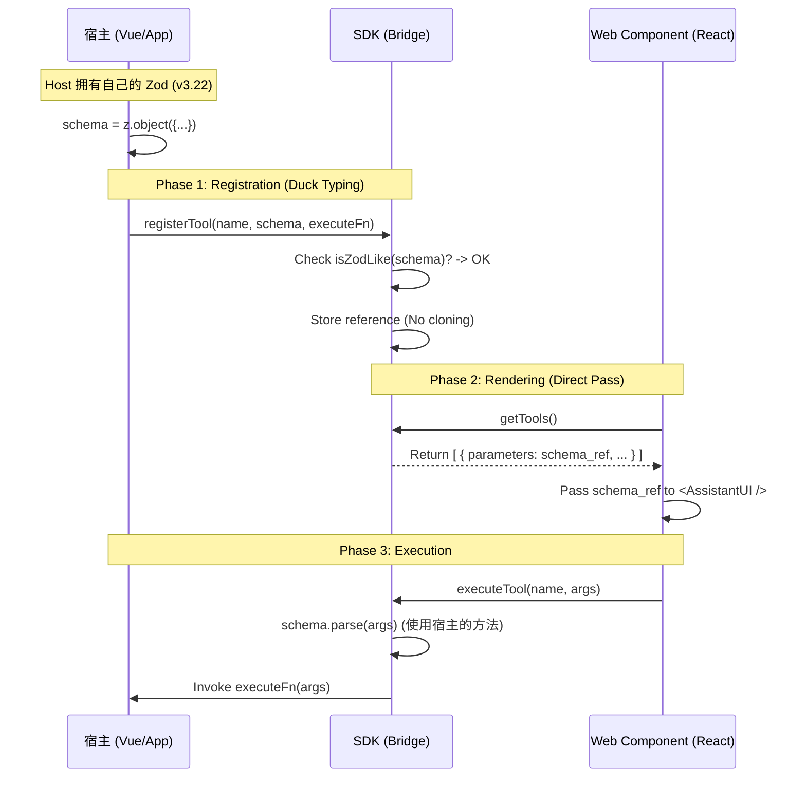

# 技术架构设计文档：SDK "Universal Bridge" 模式

**Version:** 2.0.0 (Compatibility Focused)
**Status:** **Approved for Development**
**Architect:** Senior CPTO

## 1. 核心目标 (Objective)

构建一个**零依赖入侵、高兼容性**的 SDK，连接宿主环境（Host）与 UI 组件（Web Component）。
实现**“依赖解耦”**：SDK 不绑定特定的 Zod 版本，允许宿主自由选择依赖版本，同时确保跨环境的运行时安全。

## 2. 核心策略 (Core Strategy)

| 策略维度     | 旧方案 (Strict)    | **新方案 (Universal) - 最终选型**                                     | 优势 (ROI)                                          |
| ------------ | ------------------ | --------------------------------------------------------------------- | --------------------------------------------------- |
| **依赖管理** | SDK 强行导出 `zod` | **Peer Dependencies**: SDK 声明“我需要 Zod”，但不包含它。             | 避免包体积膨胀，支持宿主任意 Zod 版本 (v3.x)。      |
| **类型校验** | `instanceof` 检查  | **Duck Typing**: 检查对象是否具有 `.parse()` 和 `_def` 特征。         | 彻底解决跨 Bundle、跨版本的 `instanceof` 失败问题。 |
| **数据流转** | 严格类型绑定       | **Reference Passing**: 宿主创建 Schema 对象，SDK 和 UI 仅作引用传递。 | 内存零开销，UI 库直接消费原始 Schema 对象。         |

---

## 3. 架构设计 (Architecture Design)

### 3.1 数据流向 (Data Flow)



---

## 4. 详细实现规范 (Implementation Specs)

### 4.1 SDK 层 (The Universal Bridge)

**职责：** 极其轻量，只负责存储和“鸭子类型”校验。

**关键变更：** 删除 `import/export z`，增加 `utils.ts`。

```typescript
// sdk/utils.ts
/**
 * 核心：Duck Typing 校验器
 * 不依赖具体 class，只看行为
 */
export function isZodLike(schema: any): boolean {
  return (
    schema !== null &&
    typeof schema === 'object' &&
    typeof schema.parse === 'function' &&      // 核心特征：能解析
    typeof schema.safeParse === 'function'     // 核心特征：能安全解析
    // 可选：检查 schema._def 属性，但这属于 Zod 内部实现，根据需要决定是否检查
  );
}

```

```typescript
// sdk/index.ts
import { isZodLike } from './utils';

export interface ToolDefinition<T = any> {
  name: string;
  description?: string;
  parameters: any; // 我们在编译期无法预知宿主的 Zod 类型，使用 any 或泛型
  execute: (args: T) => Promise<any>;
}

export class BridgeSDK {
  private static instance: BridgeSDK;
  private tools: Map<string, ToolDefinition> = new Map();
  private listeners: Set<() => void> = new Set();

  public static getInstance(): BridgeSDK {
    if (!BridgeSDK.instance) {
      BridgeSDK.instance = new BridgeSDK();
      (window as any).__ToolAgentSDK__ = BridgeSDK.instance;
    }
    return BridgeSDK.instance;
  }

  public registerTool<T>(tool: ToolDefinition<T>) {
    // 1. 宽容校验：只要像 Zod，就是 Zod
    if (!isZodLike(tool.parameters)) {
      console.warn(`[SDK] Tool ${tool.name} parameters do not look like a Zod schema.`);
      // 这里可以选择抛错，也可以选择宽容处理
      // throw new Error(...)
    }

    this.tools.set(tool.name, tool);
    this.notify();
  }

  public getTools() {
    return Array.from(this.tools.values());
  }

  public async executeTool(name: string, args: any) {
    const tool = this.tools.get(name);
    if (!tool) throw new Error(`Tool ${name} not found`);

    // 2. 运行时调用：直接使用传入对象的方法，不管它是 v3.1 还是 v3.24
    let safeArgs = args;
    if (isZodLike(tool.parameters)) {
      safeArgs = tool.parameters.parse(args);
    }
    
    return await tool.execute(safeArgs);
  }

  public subscribe(fn: () => void) {
    this.listeners.add(fn);
    return () => this.listeners.delete(fn);
  }

  private notify() {
    this.listeners.forEach(fn => fn());
  }
}

```

### 4.2 宿主层 (Host Implementation)

**职责：** 自由安装 Zod，注入定义。

```typescript
// host/app.ts
import { z } from 'zod'; // 宿主自己的 Zod，版本由宿主 package.json 决定
import { BridgeSDK } from 'my-agent-sdk';

const sdk = BridgeSDK.getInstance();

sdk.registerTool({
  name: 'submitForm',
  description: 'Submit user info',
  // 传入的是宿主环境下创建的对象引用
  parameters: z.object({
    email: z.string().email(),
    age: z.number().min(18)
  }),
  execute: async ({ email, age }) => {
    // ...
  }
});

```

### 4.3 Web Component 层 (React UI)

**职责：** 纯粹的渲染器，透传对象。

```tsx
// wc/ToolWidget.tsx
import React, { useEffect, useState } from 'react';
import { BridgeSDK } from 'my-agent-sdk'; 
import { makeAssistantTool, AssistantUI } from 'assistant-ui';

export const ToolWidget = () => {
  const sdk = BridgeSDK.getInstance();
  const [tools, setTools] = useState(sdk.getTools());

  useEffect(() => {
    return sdk.subscribe(() => setTools(sdk.getTools()));
  }, []);

  const assistantTools = tools.map(tool => 
    makeAssistantTool({
      toolName: tool.name,
      description: tool.description,
      // 关键点：直接把内存里的对象引用传给 UI 库
      // AssistantUI 内部会调用 parameters.safeParse()，
      // 由于是引用传递，调用的其实是宿主那个 Zod 实例的方法。
      parameters: tool.parameters, 
      execute: async (args) => {
        return await sdk.executeTool(tool.name, args);
      }
    })
  );

  return <AssistantUI tools={assistantTools} />;
};

```

---

## 5. 工程化配置 (Build Configuration)

这是实现“兼容性”的关键一步。

### 5.1 SDK `package.json`

将 `zod` 移出 `dependencies`。

```json
{
  "name": "my-agent-sdk",
  "version": "1.0.0",
  "main": "dist/index.js",
  "peerDependencies": {
    "zod": "^3.0.0" 
  },
  "devDependencies": {
    "zod": "^3.22.4", 
    "typescript": "^5.0.0"
  }
  // 注意：没有 dependencies 包含 zod
}

```

### 5.2 Web Component `vite.config.ts`

防止打包 Zod 和 SDK。

```typescript
import { defineConfig } from 'vite';
import react from '@vitejs/plugin-react';

export default defineConfig({
  plugins: [react()],
  build: {
    lib: {
      entry: 'src/main.tsx',
      name: 'AgentWidget',
      fileName: 'agent-widget'
    },
    rollupOptions: {
      // 核心配置：
      // 1. my-agent-sdk: 运行时从 window 或 import map 获取
      // 2. zod: 运行时使用宿主的，或者组件内部不直接依赖 zod，而是依赖传入的对象
      external: ['my-agent-sdk', 'zod', 'react', 'react-dom'],
      output: {
        globals: {
          'react': 'React',
          'react-dom': 'ReactDOM',
          'my-agent-sdk': 'MyAgentSDK'
          // 注意：通常不需要配置 zod 的全局变量，因为我们是引用传递，不直接 new Zod()
        }
      }
    }
  }
});

```

---

## 6. 风险评估与应对 (Risk & Mitigation)

| 风险点             | 场景描述                                                                           | 应对方案                                                                                                                                                                                      |
| ------------------ | ---------------------------------------------------------------------------------- | --------------------------------------------------------------------------------------------------------------------------------------------------------------------------------------------- |
| **Zod 大版本断裂** | 宿主用了 Zod v2，UI 库只支持 Zod v3。                                              | 这是无法避免的语义冲突。SDK 的 `Duck Typing` 依然能通过（因为都有 parse），但 UI 库可能会报错。**建议：** 在文档中声明 SDK 仅支持 Zod v3+ (Peer Dep version)。                                |
| **UI 库强依赖**    | `assistant-ui` 内部如果写死了 `import { z } from 'zod'` 并进行 `instanceof` 检查。 | 需要确认 `assistant-ui` 的实现。如果它是设计良好的库，通常只消费 Schema 对象。如果它有强依赖，则 Web Component 必须自己打包一份兼容的 Zod 运行时（增加体积），或者通过 `alias` 欺骗构建工具。 |

## 7. 下一步行动 (Action Items)

1. **实现 SDK:** 编写 `isZodLike` 和核心类，配置 `peerDependencies`。
2. **验证 Duck Typing:** 写一个单元测试，Mock 一个这就具有 `parse` 方法的普通对象，确保 `registerTool` 能通过。
3. **开发 WC:** 在 React 组件中直接透传 parameters，不要做任何处理。
